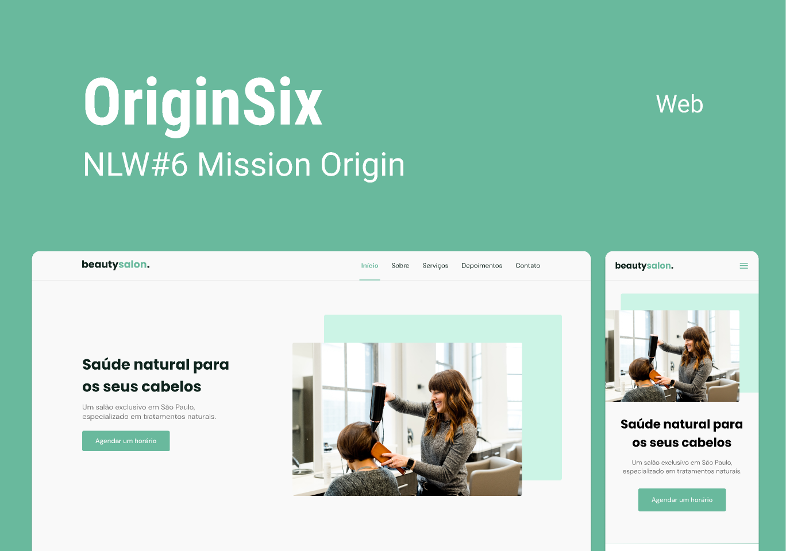

<h1 align="center">Beauty Salon (Origin Six) ✂</h1>

Projeto desenvolvido na Mission: Origin da &lt;nlw/&gt; Together, o evento aconteceu entre 20 e 27 de junho de 2021.

OriginSix é o layout de uma landing page responsiva e personalizável para o salão de beleza BeautySalon.

  <a href="#aula01">Aula 01</a>&nbsp;&nbsp;&nbsp;|&nbsp;&nbsp;&nbsp;
  <a href="#aula02">Aula 02</a>&nbsp;&nbsp;&nbsp;|&nbsp;&nbsp;&nbsp;
  <a href="#aula03">Aula 03</a>&nbsp;&nbsp;&nbsp;|&nbsp;&nbsp;&nbsp;
  <a href="#aula04">Aula 04</a>&nbsp;&nbsp;&nbsp;|&nbsp;&nbsp;&nbsp;
  <a href="#aula05">Aula 05</a>

<h2>📚 Aula 01:</h2>

### 1. Acesso ao [Figma](https://www.figma.com/community/file/1009807319507822993) contendo o projeto.

### 2. Preparando o ambiente (HTML):

- criação do arquivo index.html;
- inserindo as primeiras tags;
- utilização de tags semânticas (header, main, footer).

### 3. Preparando o ambiente (CSS):

- criação do arquivo style.css.
- conceitos: seletores, anatomia, cascading, specificity, responsividade, box model, layout.

<h2>📚 Aula 02:</h2>

### 1. Estruturas do menu;

### 2. Pack de ícones: 

  - disponibilizados os links do [IcoMoon](https://icomoon.io/app) e do [flaticon](https://www.flaticon.com/br/);
  - diretório assets.

### 4. Introdução ao JavaScript:

  - criação do arquivo main.js;
  - conceitos iniciais (tipos de dados, variáveis, objetos, funções, condições e repetições);
  - apresentação da DOM.

### 3. Menu mobile: 

- funcionalidade do menu sanduiche, seus links e do x;
- abrir ao clicar no ícone;
- tela cheia;
- esconder ao clicar. 

### 4. Seção (section):

- Sobre (imagem e texto) - [Unsplash](https://unsplash.com/) para imagens;
- Serviços (cards).

### 5. Rolagem suave;

### 6. Header scroll.

<h2>📚 Aula 03:</h2>

