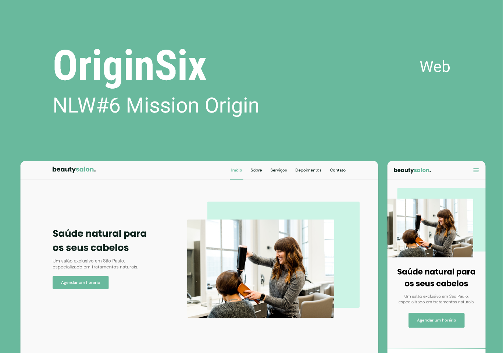

<h1 align="center">Beauty Salon (Origin Six) ✂</h1>

Projeto desenvolvido na Mission: Origin da &lt;nlw/&gt; Together, o evento aconteceu entre 20 e 27 de junho de 2021.

OriginSix é o layout de uma landing page responsiva e personalizável para o salão de beleza BeautySalon.

  <a href="#aula01">aula1</a>&nbsp;&nbsp;&nbsp;|&nbsp;&nbsp;&nbsp;
  <a href="#aula02">aula2</a>&nbsp;&nbsp;&nbsp;|&nbsp;&nbsp;&nbsp;
  <a href="#aula03">aula3</a>&nbsp;&nbsp;&nbsp;|&nbsp;&nbsp;&nbsp;
  <a href="#aula04">aula4</a>&nbsp;&nbsp;&nbsp;|&nbsp;&nbsp;&nbsp;
  <a href="#aula05">aula5</a>

  

<h2>📚 Aula 01:</h2>

1. Acesso ao [Figma](https://www.figma.com/community/file/1009807319507822993) contendo o projeto.

2. Preparando o ambiente (HTML):

- criação do arquivo index.html;
- inserindo as primeiras tags;
- utilização de tags semânticas (header, main, footer).

3. Preparando o ambiente (CSS):

- criação do arquivo style.css. 52'